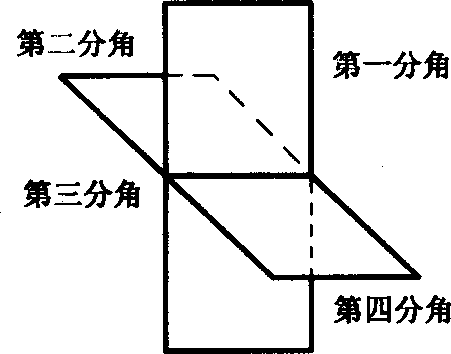
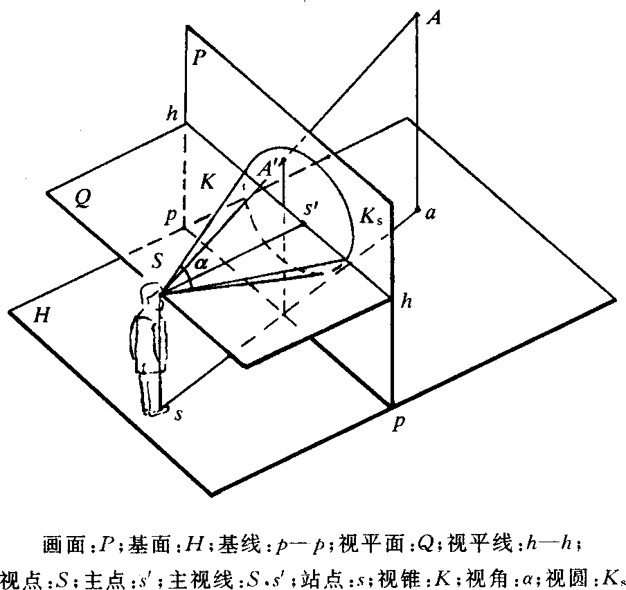

## 术语(摘自GB/T 13361-1992)

#### 技术制图通用术语

| 分类         | 术  语     | 定  义                                                       |
| ------------ | ---------- | ------------------------------------------------------------ |
| 基础术语     | 图         | 用点、线、符号、文字和数字等描绘事物凡何特性、形态、位置及大小的一种形式 |
|              | 图样       | 根据投影原理、标准或有关规定，表示工程对象．并有必要的技术说明的图 |
|              | 简图       | 由规定的符号、文字和图线所组成的带有示意性的图               |
| 一般规定术语 | 图纸幅面   | 图纸宽度与长度组成的图面                                     |
|              | 比例       | 图中图形与其实物相应要素的线性尺寸之比                       |
|              | 原值比例   | 比值为1的比例                                                |
|              | 放大比例   | 比值大于1的比例                                              |
|              | 缩小比例   | 比值小于1的比例                                              |
|              | 字体       | 图中文字、字母、数字的书写形式                               |
|              | 图线       | 起点和终点间以任意方式连接的一种几何图形，形状可以是直线或曲线，连续或不连续线 |
|              | 线素       | 不连续线的独立部分，如点、长度不同的画和间隔                 |
|              | 线段       | 一个或一个以上不同线素组成一段连续的或不连续的图线，如实线的线段或由"长划、短间隔、点、短间隔、点、短间隔"组成的双点长划线的线段 |
|              | 图形符号   | 由图形或图形与数字、文字组合的表示事物或概念的特定符号       |
|              | 尺寸       | 用特定长度或角度单位表示的数值，并在技术图样上用图线、符号和技术要求表示出来 |
|              | 标题栏     | 由名称及代号区、签字区、更改区和其他区组成的栏目             |
|              | 明细栏     | 由序号、代号、名称、数量、材料、重量、备注等内容组成的栏目   |
|              | 图框       | 图纸上限定给图区域的线框                                     |
|              | 对中符号   | 从图纸四边的中点画入图框内约5 mm的粗实线段，通常作为缩微摄影和复制的定位基准标记 |
|              | 绘图模板   | 用于直接将图形绘制到图纸或其他表面上的绘图工具               |
|              | 字体模板   | 用于准确地绘制字母、数字的绘图模板                           |
|              | 符号模板   | 用于准确地绘制图形符号或几何图形的绘图模板                   |
| 画法术语     | 视图       | 根据有关标准和规定，用正投影法所绘制出物体的图形             |
|              | 主视图     | 由前向后投射所得的视图                                       |
|              | 俯视图     | 由上向下投射所得的视图                                       |
|              | 左视图     | 由左向右投射所得的视图                                       |
|              | 右视图     | 由右向左投射所得的视图                                       |
|              | 仰视图     | 由下向上投射所得的视图                                       |
|              | 后视图     | 由后向前投射所得的视图                                       |
|              | 局部放大图 | 将图样中所表示的物体部分结构，用大于原图形的比例所绘出的图样 |
|              | 平面图     | 建筑物、构筑物等在水平投影上所得的图形                       |
|              | 立面图     | 建筑物、构筑物等在直立投影上所得的图形                       |
|              | 详图       | 表明生产过程中所需要的细部构造、尺寸及用料等全部资料的详细图样 |
|              | 简化画法   | 包括规定画法、省略画法、示意画法等在内的图示方法             |
|              | 规定画法   | 对标准中规定的某些特定表达对象，所采用的特殊图示方法         |
|              | 省略画法   | 通过省略重复投影．重复要素重复图形等达到使图样简化的图示方法 |
|              | 示意画法   | 用规定符号和(或)较形象的图线绘制图样的表意性图示方法         |
| 图的种类术语 | 零件图     | 表示零件结构、大小及技术要求的图样                           |
|              | 装配图     | 表示产品及其组成部分的连接、装配关系的图样                   |
|              | 毛坯图     | 零件制造过程中，为铸造、锻造等非切削加工方法制作坯料时提供详细资料的图样 |
|              | 型线图     | 用成组图线表示物体特征曲面（船体、汽车车身、飞机机身等型表面）的图样 |
|              | 表格图     | 用图形和表格，表示结构相同而参数、尺寸、技术要求不尽相同的产品的图样 |
|              | 空白图     | 对结构相同的零件或部件不按比例绘制且未标注尺寸的典型图样     |
|              | 外形图     | 表示产品外形轮廓的图样                                       |
|              | 安装图     | 表示设备、构件等安装要求的图样                               |
|              | 管系图     | 表示管道系统中介质的流向、流经的设备，以及管件等连接、配置状况的图样 |
|              | 方案图     | 概要表示工程项目或产品的设计意图的图样                       |
|              | 设计图     | 在工程项目或产品进行构形和计算过程中所绘制的图样             |
|              | 施工图     | 表示施工对象的全部尺寸、用料、结构、构造以及施工要求，用于指导施工用的图样 |
|              | 总布置图   | 表示特定区域的地形和所有建(构)筑物等布局以及邻近情况的平面图样 |
|              | 原理图     | 表示系统、设备的工作原理及其组成部分的相互关系的简图         |
|              | 框图       | 用线框、连线和字符、表示系统中各组成部分的基本作用及相互关系的简图 |
|              | 流程图     | 表示生产过程事物各个环节进行顺序的简图                       |
|              | 电路图     | 用图形符号，按工作顺序，表示电路设备装置的组成和连结关系的简图 |
|              | 接线图     | 表示成套装置、设备或装置的连接关系的简图                     |
|              | 逻辑图     | 主要用二进制逻辑单元图形符号所绘制的简图                     |
|              | 算图       | 运用标有数值的几何图形或图线进行数字计算的图                 |
|              | 表图       | 用点、线、图形和必要的变量数值，表示事物状态或过程的图       |
|              | 草图       | 以目测估计图形与实物的比例，按一定画法要求徒手(或部分使用绘图仪器)绘制的图 |
|              | 原图       | 经审核、认可后。可作为原稿的图                               |
|              | 底图       | 根据原图制成的可供复制的图                                   |
|              | 复制图     | 由底图或原图复制成的图                                       |

#### 剖视图和剖面图术语

| 术 语    | 定  义                                                       |
| -------- | ------------------------------------------------------------ |
| 剖视图   | 假想用剖切面剖开物体，将处在观察者和剖切面之间的部分移去，而将其余部分向投影面投射所得的图形 |
| 断面图   | 假想用剖切面将物体的某处切断，仅画出该剖切面与物体接触部分的图形。断面图可简称断面 |
| 剖切面   | 剖切被表达物体的假想平面或曲面                               |
| 剖面区域 | 假想用剖切面剖开物体，剖切面与物体的接触部分                 |
| 剖切线   | 指示剖切面位置的线                                           |
| 剖切符号 | 指示剖切面起、迄和转折位置及投射方向（用箭头或粗短画表示）的符号 |

#### 投影法术语

| 术语                           | 定义                                                         |
| ------------------------------ | ------------------------------------------------------------ |
| 表示法                         | 各种形式的技术图样信息的衾达方法，通常涉及特定的投影法、画法及标注方法等 |
| 坐标体系                       | 确定空间每个点及其相应位置之间关系的基准体系                 |
| 坐标值                         | 确定点在坐标体系中位置的一组有序数值及其相应的计量单位       |
| 坐标轴                         | 形成坐标体系的相交于一点的空间基准直线                       |
| 坐标平面                       | 任意两根坐标轴所确定的平面                                   |
| 原点                           | 坐标轴的基准点                                               |
| 直角坐标体系                   | 由三根相互垂直的轴（直角坐标轴）和相同的原点及其计量单位所构成的坐标体系 |
| 直角坐标值                     | 在直角坐标体系中，空间点到坐标平面的距离                     |
| 直角坐标轴                     | 在直角坐标体系中，垂直相交的坐标轴                           |
| 直角坐标平面                   | 在直角坐标体系中，垂直相交的坐标平面                         |
| 极坐标体系                     | 由极坐标轴和它们的测量单位所构成的坐标体系                   |
| 极坐标                         | 在极坐标体系中，由半径（某点到原点的距离）、方位角（含该点和原点的铅垂平面与极坐标轴之间的夹角）、高度角（通过原点的水平面与通过该点与原点的直线之间的夹角）组成的空间点的坐标 |
| 极坐标轴                       | 在极坐标体系中，发自原点的水平定向直线                       |
| 柱面坐标体系                   | 发自原点的基准水平定向直线及其计量单位所构成的坐标体系       |
| 柱面坐标                       | 在柱面坐标体系中，由半径（某点到通过原点的铅垂轴的距离）、方位角（含该点和原点的铅垂平面与基准水平定向直线之间的夹角）、高度（该点到通过原点的水平面的距离）组成的空间点的坐标 |
| 投影法                         | 投射线通过物体，向选定的面投射。并在该面上得到图形的方法     |
| 投射中心                       | 所有投射线的起源点                                           |
| 投影（投影图）                 | 根据投影法所得到的图形                                       |
| 投射线                         | 发自投射中心且通过被表示物体上各点的直线                     |
| 投影面                         | 投影法中．得到投影的面                                       |
| 平行投影法                     | 投射线相互平行的投影法（投射中心位于无限远处）               |
| 中心投影法                     | 投射线汇交一点的投影法（投射中心位于有限远处）               |
| 正投影法                       | 投射线与投影面相垂直的平行投影法                             |
| 正投影（正投影图）             | 根据正投影法所得到的图形                                     |
| 斜投影法                       | 投射线与投影面相倾斜的平行投影法                             |
| 斜投影（斜投影图）             | 根据斜投影法所得到的图形                                     |
| 多面正投影（多面正投影图）     | 物体在互相垂直的两个或多个投影面上所得到的正投影。将这些投影面旋转展开到同一图面上。使该物体的各视图（正投影图）有规则地配置，并相互之问形成对应关系 |
| 分角                           | 用水平和铅垂的两投影面将空间分成的四个区域，并按顺序编号（见图1） |
| 第一角投影（第一角画法）       | 将物体置于第一分角内，并使其处于观察者与投影面之间而得到的多面正投影。以主视图为基准．其他视图的配置如下：俯视图配置在主视图的下方；左视图配置在主视图的右方；右视图配置在主视图的左方；仰视图配置在主视图的上方；后视图配置在主视图的右方 |
| 第三角投影（第三角画法）       | 将物体置于第三分角内．并使投影面处于观察者与物体之间而得到的多面正投影。以主视图为基准，其他视图的配置如下：俯视图配置在主视图的上方；左视图配置在主视图的左方；右视图配置在主视图的右方；仰视图配置在主视图的下方；后视图配置在主视图的右方 |
| 向视配置法                     | 图样上视图和剖视图自由配置的表示法。每个视图和剖视图通常用注在主视图上表示投射方向的箭头旁的大写字母识别。也可在视图下方标出图名识别 |
| 标高投影                       | 在物体的水平投影上，加注某些特征面、线以及控制点的离程数值和比例的单面正投影 |
| 等高线                         | 标高投影中，预定高度的水平面与所表示表面的截交线             |
| 镜像投影                       | 物体在平面镜中的反射图像的正投影                             |
| 形象化表示法                   | 物体逼真图像的技术或艺术的两维表示法                         |
| X射线图                        | 通常用透视投影表示。对于表示较复杂的物体，假定这些物体局部是透明的，以便展示其内部构造 |
| 分解图                         | 通常_用轴测投影或透视投影表示。物体的装配件按相同比例绘制，沿公共轴线按合适顺序相互分离，能正确表示出它们的相互关系 |
| 轴测投影（轴测图）             | 将物体连同其直角坐标体系．沿不平行于任一坐标平面的方向，用平行投影法将其投射在单一投影面上所得到的图形 |
| 正轴测投影                     | 用正投影法得到的轴测投影                                     |
| 斜轴测投影                     | 用斜投影法得到的轴测投影                                     |
| 轴向角                         | 轴测投影中，任意两根直角坐标轴在轴测投影面上的投影之间的夹角 |
| 轴向伸缩系数                   | 直角坐标轴的轴测投影的单位长度与相应直角坐标轴上的单位长度的比值 |
| 正等轴测投影（正等轴测图）     | 三个轴向伸缩系数均相等的正轴测投影。此时．三个轴间角相等     |
| 正二等轴测投影（正二轴测图）   | 两个轴向伸缩系数相等的正轴测投影                             |
| 正三轴测投影（正三轴测图）     | 三个轴向伸缩系数均不相等的正轴测投影                         |
| 斜等轴测投影（斜等轴测图）     | 三个轴向伸缩系数均相等的斜轴测投影                           |
| 斜二等辐_测投影（斜二轴测图）  | 轴测投影面平行于一个坐标平面，且平行于坐标平面的那两个轴的轴向伸缩系数相等的斜轴测投影 |
| 水平斜轴测投影（水平斜轴测图） | 轴测投影面平行于水平坐标平面的斜轴测投影                     |
| 斜三轴测投影（斜三轴测图）     | 三个轴向伸缩系数均不相等的斜轴测投影                         |
| 透视投影（透视图、透视）       | 用中心投影法将物体投射在单一投影面上所得到的图形             |
| 灭点                           | 透视投影中，直线上无穷远点的透视                             |
| 一点透视                       | 画面平行于物体的一个坐标平面（即长度和高度棱线）所得到的透视图 |
| 鸟瞰透视                       | 从高空向下投射所得到的透视图                                 |
| 蛙眼透视                       | 从基面以下向上投射所得到的透视图                             |
| 两点透视                       | 画面与物体的两个直立坐标平面成一定偏角，且平行于物体的高度棱线所得到的透视图 |
| 三点透视                       | 画面与物体的三个坐标平面（即长、宽、高棱线）倾斜所得到的透视图 |
| 画面                           | 在透视投影中，绘制透视图的投影面，见图2                      |
| 视点                           | 在透视投影中，观察者单眼所在的位置．即投射中心。见图2        |
| 基面                           | 在透视投影中．观察者所站立的水平地面，即物体所在的水平面，见图2 |
| 基线                           | 在透视投影中．画面与基面的交线，见图2                        |
| 视平面                         | 在透视投影中，通过视点（投射中心）的水平面，见图2            |
| 视平线                         | 在透视投影中，视平面与画面的交线，见图2。它是所有水平直线的灭点的几何位置 |
| 主视线                         | 在透视投影中，通过视点目与画面垂直相交的视线（投射线），见图2 |
| 主点                           | 在透视投影中，主视线与画面的交点，见图2。它是与画面相垂直的所有直线的灭点 |
| 站点                           | 在透视投影中，视点在基面上的正投影，见图2，即观察者站立的位置 |
| 视锥                           | 在透视投影中，以视点为顶点和主视线为轴的正圆锥，见图2        |
| 视角                           | 视锥的锥顶角，见图2                                          |
| 视圆                           | 在透视投影中，视锥与画面的交线，见图2                        |
| 距离点                         | 在透视投影中，与画面成45°的水平线的灭点                      |

图1

图2